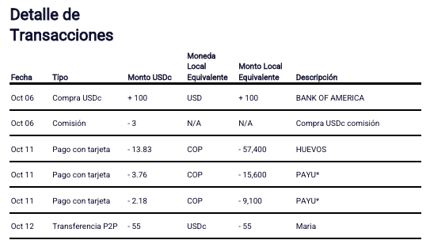

# DolarApp Statement Parser

A console app to parse DolarApp PDF statements to CSV files

## Objective

Given DolarApp statement files, i.e. `DolarApp Statement - 2024-12.pdf`, parse it and generate a `.csv` file with the movements to easily load them in Excel or any expense tracking or budget app.

## How to use

The application looks for all DolarApp statement files in the current directory, or the directory path provided as parameter. If files are found, it creates a CSV file in the same directory with all the movements found in the PDF files.

The statements can be from any period, but the files should follow the format which includes only the Date, Type, USD Amount, Currency, Local Amount and Description columns, and currencies with US format, something that in my case started happening only after March 2025. Statements generated via the app for any period will follow this format.

The transaction details section should look like this for the application to work:

## How it works

The application looks for files starting with `DolarApp Statement - ` and ending with `.pdf` in the current directory or the directory provided as parameter.

If files are found, it uses the year in the filename to set the date in the transactions since its missing from the Date column.

The application then uses the [Aspose.PDF](https://github.com/aspose-pdf/Aspose.PDF-for-.NET) library to extract text line and line, and evaluates if the line looks like a transaction by checking its length and if the first 6 characters can be parsed as a date. If the line is a transaction then it extracts all the other columns making sure to parse currencies and text according to the format used by DolarApp and in a way that can be read by Excel, and saves this output line by line in a new CSV file.
